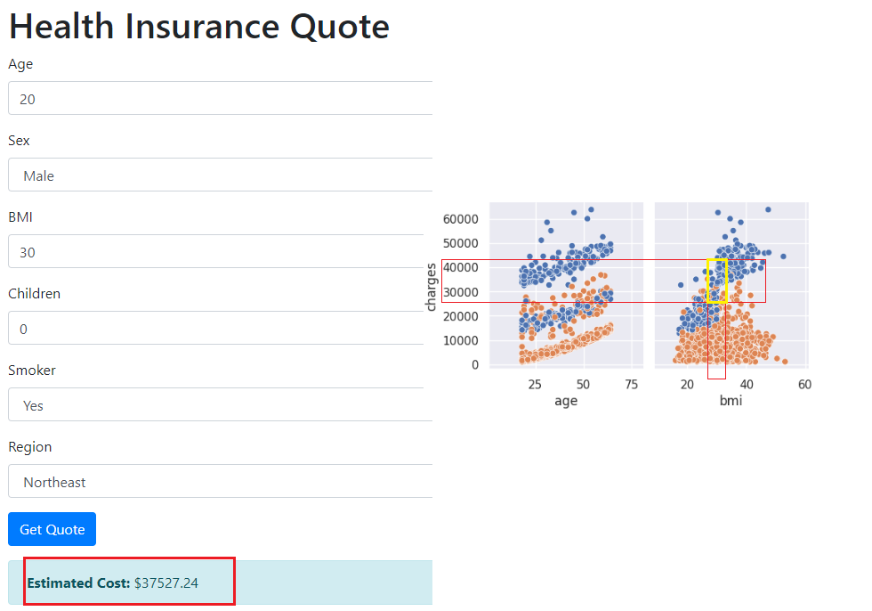

# Predição de Custos de Seguros de Saúde

Este projeto visa construir um modelo preditivo para estimar o custo de seguros de saúde ("charges") com base em características individuais.

## Etapas do Projeto:

### Análise Exploratória de Dados (EDA):

* Carregamento e análise do conjunto de dados.
* Exploração da distribuição das variáveis e identificação de outliers.
* Verificação de valores ausentes.
* Análise das relações entre as variáveis e o custo do seguro.

### Pré-processamento dos Dados:

* Codificação numérica de variáveis categóricas (sexo, fumante e região).
* Normalização de variáveis numéricas (StandardScaler e MinMaxScaler).

### Seleção de Modelo:

* Teste de diversos modelos de regressão (Regressão Linear, Ridge, Lasso, Random Forest, Gradient Boosting, Decision Tree, XGBoost, SVR e KNN).
* Avaliação dos modelos usando validação cruzada e seleção do modelo com menor MSE.

### Ajuste de Hiperparâmetros:

* Otimização do modelo selecionado através de busca em grade (GridSearchCV).

### Treinamento e Avaliação do Modelo:

* Treinamento do modelo com os dados de treino.
* Avaliação do modelo nos dados de teste usando métricas como MAE, MSE, R² Score e RMSE.
* Exploração do tratamento de outliers.

### Conclusão:

Concluimos ser o XGBoost Regressor o melhor modelo tanto do ponto de vista de R² quanto RMSE, que foram os melhores resultados comparado aos demais modelos testados.

Teste realizado realizado mostra que o resultado ficou dentro do esperado considerando gráficos de dispersão.

