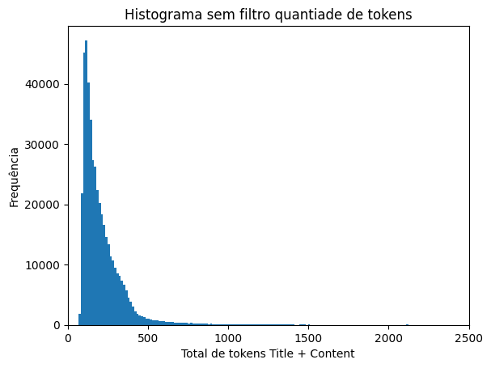
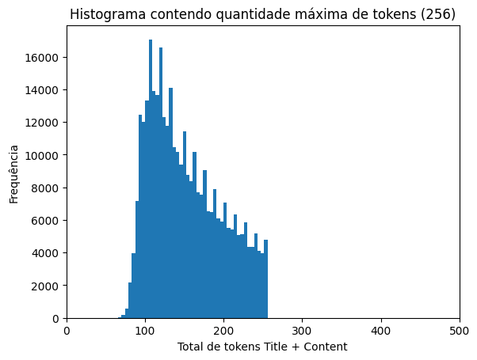
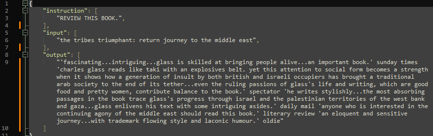
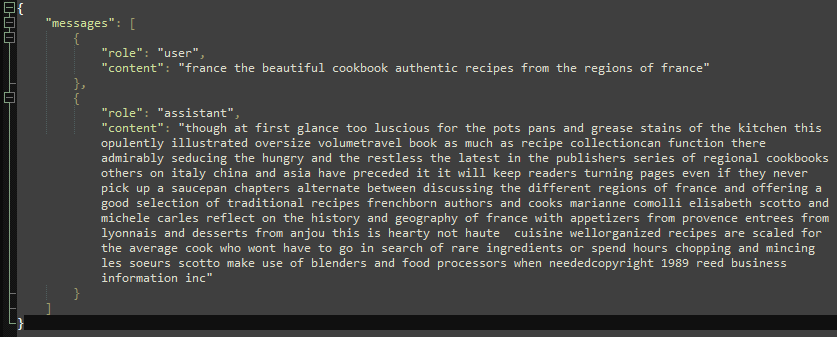

# Fine Tuning foundation models
Este projeto teve como objetivo realizar o fine-tuning de diferentes foundation models para comparar seu desempenho em diversos aspectos. Os critérios de avaliação utilizados foram:
- Precisão: Capacidade do modelo de fornecer respostas relevantes e corretas no contexto da tarefa.
- Eficiência no treinamento: Tempo e recursos necessários para concluir o processo de fine-tuning.
- Custo operacional: Custos associados ao treinamento e ao uso dos modelos ajustados.
- Flexibilidade: Capacidade do modelo de se adaptar a diferentes cenários e tarefas.

## Estrutura de pastas e conteúdos
- [x] colab: Arquivos fontes para serem utilizados no colab.
- [x] dados: Arquivos de treinamento já no formato do foundation model.
- [x] resultados: Planilha contendo os testes comparativos realizados
- [x] imagens: Gráficos de apoio desse documento

## Etapas do Projeto:
### Preparação dos dados
Os resultados dos testes iniciais com os primeiros modelos treinados foram insatisfatórios, apresentando respostas muitas vezes desconexas, chegando a algo próximo do delírio. Para melhorar a qualidade do treinamento, o grupo decidiu explorar mais a fundo os dados e aplicar filtros que priorizassem conteúdos representativos de livros. A seleção foi guiada por palavras-chave como "author" e "copyright", buscando controlar melhor o ambiente de treinamento, seguindo o princípio de "garbage in, garbage out".

A curadoria dos dados foi realizada com base nos seguintes critérios:

- Remoção de Dados Incompletos: Eliminação de linhas com valores nulos nos campos **Title** ou **Content**.
- Filtro por Soma de Tokens: Seleção de linhas onde a soma de tokens entre **Title** e **Content** fosse igual ou superior a 257.
- Filtro por Palavras-Chave: Manutenção de linhas que contivessem as palavras "copyright" ou "author" em **Title** ou **Content**.
- Divisão do Conjunto de Dados: Uso das primeiras 1500 linhas para treinamento e das 500 linhas subsequentes para teste.
- Critérios de Tamanho: Seleção de linhas em que:
  - Title contivesse mais de 40 caracteres.
  - Content contivesse mais de 400 caracteres.

> [!NOTE]
> Em especial para o treinamento do GPT4 foi necessário considerar a quantidade máxima de tokens, por isso o filtro de até 256 tokens.

 

Com essas melhorias na seleção dos dados, buscou-se criar um conjunto de treinamento mais consistente e representativo, aumentando as chances de sucesso nos modelos subsequentes.

### Comparação das estruturas dos dados de treinamento
Um arquivo de treinamento típico para o LLaMA pode estar em formato JSON Lines (JSONL) ou outro formato serializável, onde cada exemplo de treinamento tem a seguinte estrutura:

- instruction:
        A instrução principal que orienta o modelo sobre o que ele deve fazer.
        Exemplo: "Resuma o seguinte texto."

- input:
        O contexto ou os dados específicos associados à instrução. Pode estar vazio ("") se a instrução for autoexplicativa.
        Exemplo: "O texto descreve a ascensão de Napoleão ao poder durante a Revolução Francesa."

- output:
        A resposta esperada do modelo, que é gerada com base na instrução e no contexto fornecido.
        Exemplo: "Napoleão subiu ao poder durante a Revolução Francesa devido à sua habilidade militar e alianças políticas."

 

Para o GPT4 temos o seguinte:

- role: Define o papel do participante na interação. Pode ser:
  - system: Define as regras ou o contexto geral da conversa.
  - user: Representa a entrada do usuário.
  - assistant: Contém a resposta esperada do modelo.
- content: O texto associado ao papel (role).

 

### Resultados
- Precisão e eficiência no treinamento
  - Em alguns casos, o LLaMA gerou respostas genéricas, como "I have reviewed this book", possivelmente indicando uma lacuna nos dados pré-treinados. Ainda assim, o modelo apresentou ganhos mais significativos em comparação ao GPT-4 em determinados cenários.
  - O gpt-4o-mini-2024-07-18, utilizado neste fine-tuning, incorporou adequadamente o treinamento e começou a produzir respostas mais contextualizadas. Contudo, a baixa qualidade de alguns dados no conjunto de treinamento impactou negativamente a clareza das respostas, gerando problemas como falhas na construção de conjunções e advérbios. Isso resultou em textos por vezes confusos e pouco coerentes.

- Custo Operacional e flexibilidade
  - O LLaMA processou 5000 exemplos no mesmo intervalo de tempo que o GPT-4 processou 1500, ambos completando o treinamento em até 20 minutos. Considerando que o GPT-4 realiza todo o processo via API, podemos afirmar que ambos apresentaram um desempenho satisfatório em termos de tempo de resposta.
  - O LLaMA rodou no Colab sem custos adicionais enquanto no GPT4 foi pago 3 dólares para treinar e rodar testes do modelo.
  - Ambos modelos conseguiram mesclar pré-treino com os novos dados e gerar novas saídas.

