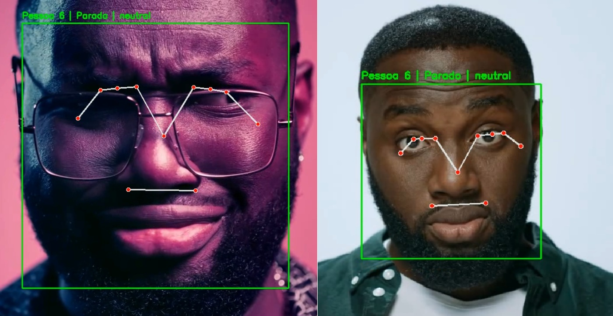
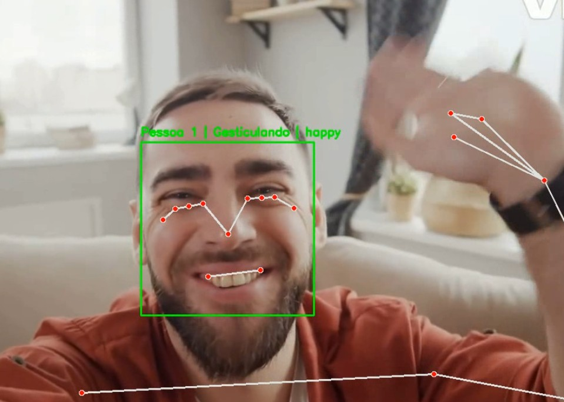
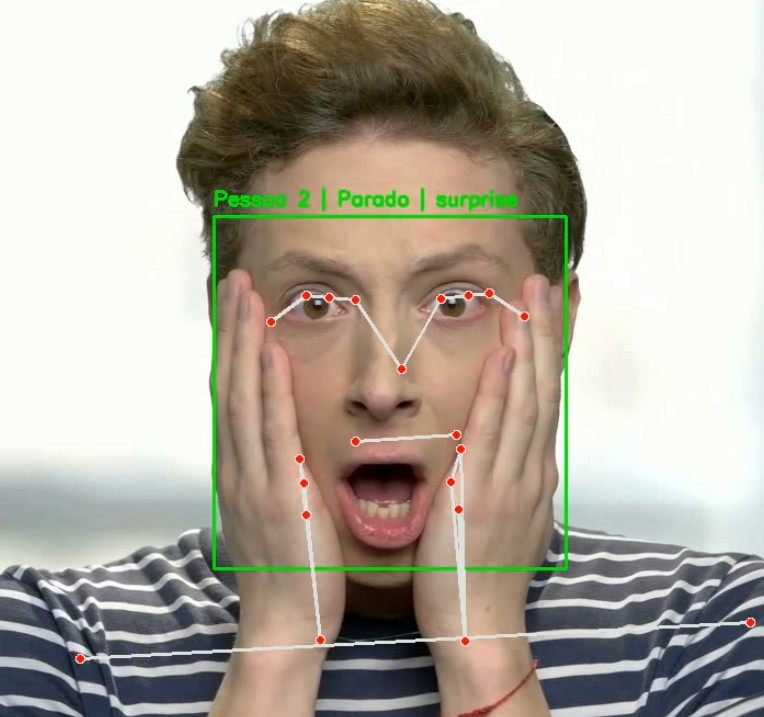

# Análise de vídeos
Este projeto tem como objetivo realizar a análise de um vídeo para:
- Reconhecer rostos de forma individual;
- Identificar as principais emoções de cada rosto, utilizando a biblioteca DeepFace;
- Detectar atividades com base em landmarks e cálculos de distância dos movimentos corporais;
- Gerar um resumo automático das detecções realizadas.

## Estrutura de pastas e conteúdos
- [x] arquivo main.py na pasta raiz contendo todo código do projeto
- [x] dados/in: Vídeos utilizados no processo de análise.
- [x] dados/out: Vídeos processados contendo resultados analizados.
- [x] resultados: Captura de imagens de frames para análise de qualidade do algoritmo.

## Principais Parâmetros

- **`N_FRAMES_HISTORY`**: controla quantos frames manter no histórico de atividade de cada indivíduo para suavizar a classificação.  
- **`MIN_STABLE_FRAMES`**: define após quantos frames uma emoção é considerada “estável” antes de checar mudança brusca.

## Estrutura Geral do Código

1. **Carregamento do Vídeo e Escrita**  
   - `load_video` e `create_video_writer`: manipulam a abertura do vídeo e a criação do arquivo de saída.

2. **Reconhecimento Facial**  
   - `face_recognition.face_locations` e `face_recognition.face_encodings` localizam e extraem *encodings* dos rostos em cada frame.  
   - `get_or_create_individual_record` identifica se o rosto corresponde a alguém já conhecido ou cria um novo registro.

3. **Análise de Emoções**  
   - `analyze_emotion`: usa a biblioteca DeepFace para determinar a emoção dominante no recorte de cada rosto.  
   - `detect_abrupt_emotion_change`: verifica se a emoção atual difere abruptamente de outra que estava estabilizada há vários frames.

4. **Detecção de Pose e Classificação de Atividades**  
   - O script instancia `mp_pose.Pose` para extrair *landmarks* corporais básicos.  
   - `classify_activity` verifica a posição dos punhos, joelhos e quadril para deduzir se a pessoa está sentada, parada ou gesticulando.  
   - `find_closest_pose_to_face` faz uma correspondência simples entre bounding box de rosto e *landmarks* do corpo (caso apenas uma pessoa seja detectada por frame).

5. **Processamento Frame a Frame**  
   - `process_frame` integra tudo:  
     1. Identifica rostos  
     2. Analisa emoções  
     3. Combina pose ↔ rosto  
     4. Classifica atividade  
     5. Desenha retângulos e rótulos no frame

## Fluxo de Execução

1. **Configurar e Instalar Dependências**  
   ```
   pip install opencv-python numpy dlib face_recognition deepface mediapipe tf-keras
   ```

2. **Rodar o Script**  
   - Ajuste `input_video_path` e `output_video_path`.  
   - Execute `python main.py`.  

3. **Verificar o Vídeo de Saída**  
   - O arquivo de saída conterá retângulos identificando rostos e textos indicando ID, atividade e emoção.  
   - Caso haja mudança brusca de emoção, a mensagem “Mudança Brusca!” é desenhada próxima ao rosto.  

4. **Consultar o Resumo**  
   - Ao final, o script mostra no console as informações de cada pessoa (quantos indivíduos totais, atividades mais frequentes, quantas trocas bruscas de emoção etc.).


## Resultados

### Reconhecimento Facial (Curiosidade)

Nosso algoritmo sugeriu que a pessoa que apareceu fazendo careta em uma cena poderia ser a mesma vista em outra cena, porém sem óculos. Após análise supervisionada, o grupo concluiu que, de fato, se tratava do mesmo indivíduo.



---

### Análise de Expressões Emocionais + Detecção de Atividades

**Pessoa feliz e gesticulando**  


**Pessoa surpresa**  


---

### Geração de resumo
```
Processando frames: 100%|██████████████████████████████████████████████████████████████████████████████████████████████████████████████████████████████████████████████████████████████████████████████████████████████████████████████████████| 753/753 [25:27<00:00,  2.03s/it]

===== RESUMO =====
Total de frames analisados: 753
Quantidade de indivíduos únicos detectados: 3

 - Pessoa 1
   Atividade mais frequente: Parado
   Última emoção detectada: happy
   Mudanças bruscas de emoção: 0


 - Pessoa 2
   Atividade mais frequente: Parado
   Última emoção detectada: happy
   Mudanças bruscas de emoção: 3


 - Pessoa 3
   Atividade mais frequente: Parado
   Última emoção detectada: neutral
   Mudanças bruscas de emoção: 2

```

